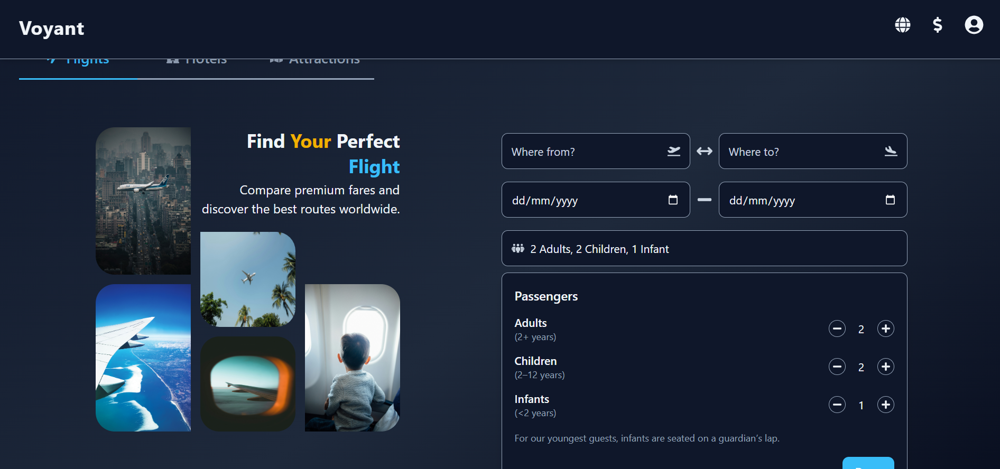

# Voyant - Travel Planner App

Voyant is a modern travel planner application built with **Vite** and **TailwindCSS**.  
It allows users to search for destinations, view detailed travel information, and plan trips by creating personalized itineraries.



## Features

- 🔍 Search for destinations
- 🏨 Browse hotels
- ✈️ Explore flight offers
- 📍 View detailed destination information
- 🗓️ Create and manage travel itineraries

## Tech Stack


## Components

### Layout System

Voyant uses a modular layout architecture with reusable components:

- **Header** – Provides navigation and accessibility features using ARIA labels and keyboard focus states.
- **Footer** – Includes semantic role definitions (`role="contentinfo"`) and high-contrast design for visibility.
- **Layout** – Wraps the header, main content, and footer for consistent structure across pages.

### Accessibility

Voyant prioritizes accessibility best practices:

- Semantic HTML elements (`header`, `nav`, `main`, `footer`).
- ARIA labels for assistive technologies.
- Focus outlines and keyboard navigability.
- Color contrast verified for light and dark modes.

### Theming

The project includes **light and dark mode support** powered by CSS variables for a seamless color theme transition.

```css
/* Example color variables */
/* Dark theme */
--color-bg: linear-gradient(to bottom right, #0f172a, #1e293b, #020617);
--color-text-primary: #f1f5f9;
--color-text-secondary: #cbd5e1;

/* Light theme */
--color-bg: linear-gradient(to bottom right, #f8fafc, #ffffff, #f1f5f9);
--color-text-primary: #0f172a;
--color-text-secondary: #334155;
```

## Flights Page

The **Flights Landing Page** provides users with a visually engaging interface to start planning trips:

- **Search Form**  
  Includes inputs for:

  - Origin and destination
  - Departure and return dates
  - Passengers
  - Cabin class selection
  - Direct flight toggle  
    (All inputs are accessible with proper labels and focus states)

- **Tabs Navigation**  
  Switch between **Flights**, **Hotels**, and **Attractions** sections (UI only, functionality coming soon).

### ⚠️ Note

Currently, the page is **not functional** — form submissions and tab content switching will be implemented in future iterations.

## Routing & Project Structure

### Routing

Voyant now uses **React Router DOM** for client-side navigation.

Example route structure:

```tsx
<Route path="/" element={<Flights />} />
<Route path="/flights/results" element={<FlightsResults />} />
<Route path="/flight/booking" element={<FlightBooking />} />
<Route path="/flight/itinerary" element={<FlightItinerary />} />
```

## Button Component

A reusable Button component was added to maintain consistent styling and behavior across the app.

## Flights Results Page

The **Flights Results Page** displays available flight options based on user input.  
Currently, it uses **mock data** to simulate results until the Amadeus API integration is complete.

### Features

- Responsive list/grid layout for flight results
- Displays mock flight details such as:
  - Airline name and logo
  - Departure and arrival times
  - Flight duration
  - Cabin class and price
- Each **FlightCard** now links to its respective **Itinerary Details Page**.
- Enhances navigation by allowing users to click a flight result and view detailed trip information.

### Data

For now, the data is static and located in a mock data file within the project.  
This setup allows for easy testing of the layout and styling before connecting to the live API.

## Utility Functions & Data Structures

Voyant now includes **helper functions** and **data interfaces** to streamline flight data handling:

### Helper Functions

- `formatDate(isoString: string): string`
- `formatStops(segments: Segment[]): string`
- `getCabinClassAndBaggage(flight: flightOffer):{cabin: string;bags: string;}: string`

### Flight Data Structures

- **FlightOffers interface**: Defines the structure of flight offer objects.

  Example usage:

  ```ts
  const flight: FlightOffer = mockData[0];

  console.log(formatDate(flight.itineraries[0].segments[
                      flight.itineraries[0].segments.length - 1
                    ].arrival.at
                  ).date));
  console.log(formatStops(flight.itineraries[0].segments));
  console.log(getCabinClassAndBaggage(flight.cabin, flight.bags));
  ```

## Flights Results Integration

The **Flights Results Page** now dynamically fetches data from a local mock JSON file (`/flightoffers.json`) and renders it using the **FlightCard** component.

### Implementation Overview

- **Mock JSON file**: Contains sample flight offers to test UI and layout before API integration.

- **Data Fetching**

  - Uses `fetch()` inside a `useEffect()` hook to retrieve mock flight data.
  - Handles loading and error states gracefully.
  - Updates component state (`flights`, `loading`, `error`) accordingly.

- **Component Integration**
  - Each flight result is displayed through a reusable **FlightCard** component.
  - `FlightCard` presents flight details such as airline, departure/arrival, stops, duration, and price.

### Example Code

```tsx
useEffect(() => {
  const fetchFlights = async () => {
    try {
      const response = await fetch("/flightoffers.json");
      if (!response.ok) throw new Error("Failed to fetch flight data");
      const data = await response.json();
      setFlights(data.data);
      setLoading(false);
    } catch (err) {
      setError((err as Error).message);
      setLoading(false);
    }
  };
  fetchFlights();
}, []);
```

## Layout Control

Voyant now supports **conditional layout rendering** using React Router’s `useLocation()` hook.  
Certain pages (like detailed itineraries or full-screen modals) are intentionally excluded from the global layout.

### Implementation Logic

- Defined an array of paths that **should not** include the default layout (header & footer).
- The layout conditionally renders based on the current route’s pathname.

Example:

```tsx
const location = useLocation();
const noLayoutPaths = ["/flight/itinerary"];

const shouldUseLayout = !noLayoutPaths.some((path) =>
  location.pathname.startsWith(path)
);
```

### Use Case

This ensures pages such as:

- `/flight/itinerary`
- Future pages like `/auth/login` or `/checkout` can render without the global header and footer, allowing for a cleaner and more focused UI.

## Confirmed Flight Offers

The project now includes a dedicated **Confirmed Flight Offers** data model and mock dataset used for the **Flight Details / Itinerary Page**.

### Data & Interface

- **`confirmedflightoffers.json`**

  - Contains structured mock data representing confirmed flight bookings.
  - Mirrors the structure expected from the Amadeus API’s confirmed flight response.

- **`ConfirmedFlightOffer` Interface**
  - Defines TypeScript typings for confirmed flight details:
    - Flight segments (origin, destination, times)
    - Pricing and baggage details

## Itinerary Page

Added an interactive flight itinerary details page displaying confirmed flight offers.

### Features

- **ItineraryHeader Component**:
  - Displays origin, destination, travel dates, passengers, and flight duration.
  - Includes “Book Now” button for CTA.
  - Includes back navigation and share icons (non-functional for now).
- **ItineraryCard** – Shows key trip details (origin, destination, stops).
- **ItineraryDetails** – Contains two main sections:
  - **Overview Card** – High-level summary (airline, class, number of stops, total duration).
  - **Flight Details** – Displays each leg of the journey (departure, arrival, duration, and airline name).
- Added **ItineraryFareDetails** component to display price breakdown and fare rules.
- Updated “Book Now” action: now a **link styled as a button** that redirects users to the `/flight/booking` page for a seamless transition to checkout.

### Supporting Files

- **airportCities.ts** – Maps IATA codes to readable city names.
- **confirmedflightoffers.json** – Mock data for confirmed flight details.
- **TypeScript Interfaces** – Strongly typed structure for confirmed flight offers and details.
- **airportNames.ts** – Maps airport codes to full airport names.
- **airlines.ts** – Provides airline names from IATA codes.
- **Helper Functions**:
  - `formatDuration()` – Converts flight durations into readable format (e.g., 5h 35m).
  - `getAirportName()` – Retrieves full airport name from code.
  - `getAirlineName()` – Retrieves airline name from code.

## Booking Page

- Added `/flight/booking` route to the app (excluded from Layout wrapper for a clean booking interface).
- Booking flow begins directly from the Itinerary page.
- Introduced a **dynamic traveler management system** powered by `createTravelersFromPricing` helper.
- Displays booking cards summarizing traveler details:
  - Avatar circle with **initials**.
  - Passenger **type** (Adult, Child, Infant).
  - Passenger **name** (if provided).
  - **Checkmark (✅)** for completed details or **chevron (›)** for pending info.
- Integrated **state transfer** from the “Book Now” link in the Itinerary page for seamless context.
- Added a dedicated **Booking interface** to structure traveler data and handle flight-specific state.

## Getting Started

### Prerequisites

- Node.js (v18+ recommended)
- npm or yarn

### Installation

```bash
# Clone the repository
git clone https://github.com/Mia06-coder/alx-fe-capstone-travel-planner.git

# Install dependencies
npm install
```

### Development

```bash
# Start the development server
npm run dev
```

### Build

```bash
# Build for production
npm run build
```

## Roadmap

- [ ] Implement destination search
- [ ] Integrate flight offers from Amadeus API
- [ ] Integrate hotel listings
- [ ] Add itinerary planning feature
- [ ] User authentication (future)
- [ ] Mobile-friendly responsive design

## License

This project is licensed under the MIT License.

## Contact

Made with ❤️ by **Mia Mudzingwa**

- GitHub: [Mia06-coder](https://github.com/Mia06-coder)
- LinkedIn: [mia-mudzingwa](https://www.linkedin.com/in/mia-mudzingwa)
